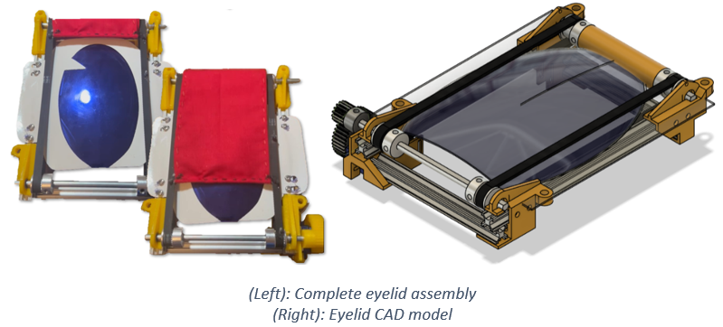
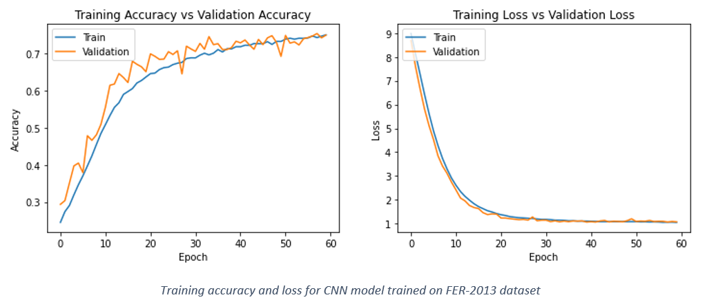

# Junior-Jay Animatronic Mascot 

<!-- Insert documentation video  -->

The scope of this project was to develop a wearable, Disney-style, animatronic suit with actuated facial features for the University of Kansas's flagship line of "Jayhawk" mascots. The project was sponsored by the Mechanical Engineering Department at the University of Kansas, with the primary client being the University of Kansas head mascot coach. The initiative aimed to revolutionize the university's mascot program by incorporating advanced, expressive features into a new mascot called "Junior Jay". The primary requirements outlined by the client included the ability for the mascots to display a wide range of dynamic, real-time facial expressions, like those seen in professionally animated characters. 

  

Designing an entirely new mascot head from the ground up was not feasible for the financial and time contraints of this project, so the University of Kansas athletics department graciously donated a retired "Baby Jay" mascot head for the team to retrofit into a proof-of-concept prototype for Junior Jay. Without their support, this project would not be possible. 

This project provided a great mix of mechanical, electrical, and software engineering challanges. The engineering objectives were to modify this retired mascot head with seamless control of the mouth, eyebrow, and eyelid actuation mechanisms using custom facial expression detection & control software, while maintaining durability, comfort, and ease of use. The project started in Aug. 2023 with initial drafts of mechanical models, code, and electrical schematics, then concluded in late Apr. 2024 with a functional protoype that met the majority of our project objectives. Below will be an outline of the final state of these three systems. 

  

## Mechanism Sub-Systems
### Beak  

Goal: Open/close beak to simulate smile, shock.

The beak assembly consisted of a lightweight aluminum frame inserted into the original, detached foam beak to provide rigidity and a means for the servo motors to drive the beak. We selected servos rated for 45 kg·cm of torque, suitable for the high-torque demands of our application. This choice was driven by the requirement to counter the beak weight of 0.7 kg (6.87 N), with center of gravity centered 230 mm away (1.58 Nm Torque). After installation, the foam beak was re-stitched to the rest of the head for aesthetic purposes. A primary focus was on ensuring robustness and minimizing weight, and the final frame design shown below was no more than 0.4 kg. 

  

### Eyebrows  

Goal: Rotate eyebrows to display nuanced emotions. 

To enable the mascot to express nuanced emotions, precise control over the eyebrows was essential. The final design acheived this by incorporating each eyebrow as one of the links in a three-bar linkage driven by two servos. This gave each eyebrow two ways to pivot, and thus 2 DOF. Each servo connects to one of the other two links, one which keeps its pivot at a fixed distance, and one wich has a slider cutout that allowed for its pivot to translate back and forth. The result is that the eyebrow can raise and lower itself without changing the angle it is oriented at (thus height and angle can be controlled separetely). Given the aesthetic design constraints, the eyebrow actuation mechanisms were concealed inside the head and behind the eyebrow. This in turn necessitated custom-printed shaft extentions so the servo shafts could reach through small holes in the forehead to connect to the links on the outside of the head. Press-fit threaded inserts and a star pattern connection on the shafts ensured the arms did not slip.

  

### Eyelids  

Goal: Open/close eyelids to simulate blinking.

To enable the animatronics' eyelid functionality, the eyes of the original mascot head had to be removed and offset a small distance to give space for the eyelid fabric to operate. The opportunity to fully rework the eye design was taken. This process involved vacuum forming a PETG plastic sheet over a 3D printed buck, which was then painted with a one-way reflective mirror coating. This new eye was mounted to a frame, along with, conveniently, all the eyelid actuation mechanicms and even the eyebrow servos. This allowed for easy removal of the whole assembly when maintentnce was required. The frame was designed to support the eyebrow mechanics while providing enough space for the eyelid material to spool without increasing in diameter. For eyelid actuation, a compact timing belt system was chosen instead of gears or chains due to its reliability and quiet operation (similar to those used in 3D printers). The eyelid fabric was stiched directly to the belt. 

Initially, a DC motor was considered for this system, but its torque, size, and control limitations led to the selection of a continuous servo motor, which offers sufficient torque and simpler control. To compensate for the servo's slower speed, a gear system was incorporated to increase the speed of the eyelid movement while maintaining the necessary torque for smooth operation. Unlike a normal servo, the continuous servo has no positional feedback. To work around this, two limit switches were added to shut off the motors when tripped. A small object stiched to the belt would trip one switch when the eye was fully open, and the other when fully closed, thus shutting off the motors. 

To better understand how this system works, please watch the docummentation video linked earlier. 

  

## Expression Detection & Control Software 

Arguably the part of this project with the most innovative potential, and deviation from traditional animatronic models, is the integration of facial detection technology to control the mechanical systems described above. The software algorithm is actually a single “master” python script (master_script.py) running on the Raspberry Pi, which 
handles everything from the capturing of video frames, detection of faces, prediction of a facial expression, and sending of signal to the motors to adjust servo angles to mimic the detected expression.

Early in the development process, it was decided that due to computational limitations of the Raspberry Pi and to avoid jittery mechanical movements, the software would predict discrete emotions and control the motors in set configurations. The emotions to be predicted were "neutral", "angry", "happy", "surprised", and "sad". Separetely, the mouth and eyes would be predicted as "open" or "closed". This approach was chosen over a design that would mimic every nuanced movement of the wearer, prioritizing smooth and stable operation of the mascot.

  

The facial detection was naturally split up into different sections based on the mechanical sub-system that it would control. For control of the eyes and mouth, first open-source computer vision libraries were used to extract the coordinates of the facial landmarks (eyes and mouth in this case). Expressions were then classified by measuring the distance between a select few coordinates, such as the outer-most and upper/lower-most mouth edges, and calculating an aspect ratio (mouth height/mouth width). Naturally, when the eyes or mouth are closed, this aspect ratio decreases. Thus, a certain empirically determined ratio was selected and compared with each incoming frames to label the mouth/eyes as "closed" if below the threshold, and "open" if above the threshold. The method implemented in the final master script uses the dlib facial landmark model, although Google's MediaPipe model was also considered.

<!-- Insert EAR,MAR picture here  -->

The movement of the eyebrows, arguably the most important mechanical sub-system in dynamic emotion display, was more intricate. Two approaches were tested for detecting the wearer's emotion out of the five discrete emotions. The first approach used a similar approach to the mouth and eye detection, this time using the eyebrow facial landmark coordinates to come up with some ratio. This posed a more tricky problem that with the eyes and mouth however, as it was quickly realised that predicting emotions based on the eyebrows alone for emotions like sad, happy, and neutral were quite subtle. It would have been possible to combine the eyebrow ratio with a ratio for other landmarks on the face, but ultimately it was decided that a more effective approach would be to use an image classification model to predict discrete emotions. 

A convolutional neural network (CNN) was trained on the [FER-2013 dataset](https://www.kaggle.com/datasets/msambare/fer2013) (Facial Emotion Recognition) to classify facial expressions. The training process is documented in train-emotion-detection.py. The original pre-trained model is attached directly as model_optimal2.h5. This model was converted to a tensorflow.lite model (saved as model.tflite in convert_to_tflite.py), which is directly used in master_script.py. Readers interested in the implementation of this model, its archeture, or the training process are encouraged to reveiw these scripts. The model achieves over 75% accuracy on the validation dataset, with even better performance observed in practical use (potentially a result of the FER-2013 dataset's well-known problem with inconsistent labeling). 

  

In order to ensure the program could run as close to real-time as possible, steps were taken to reduce the computational load. One simple approach used was to limit the number of frames processed. Several different frame rates were tested, and ultimately 5 fps was chosen as a nice balance between computational low cost and quick enough updates. The images were also converted to greyscale before processing, which is what the model was trained on and also happens to be more computationally efficient. The model was run using Google’s TensorFlow.Lite library, which is purpose built for running models on lighter hardware. Challenges in detecting faces within the dark, close-up environment inside the mascot's head, even with the use of a low-light, wide-angle camera, hindered the successful demonstration of the internal camera functionality. Efforts to improve face detection under these conditions included enhancing illumination and artificially padding the frame borders to create the illusion of a more distant face. For our demonstration purposes, the camera was positioned outside the head. Future work is required to fully achieve the project's initial objectives under these specific conditions. 

  

Whatever the approach, signals to the servos were sent from the designated GPIO pins using the pigpio library. 
<!-- Readers can test the standalone software functionality by installing the packages in requirements.txt and runnign software_demo.py -->

## Electrical System

The electrical system composed of 50,000 mAh battery pack specifically chosen for a 2hr. lifetime (or that of a typical basketball game), its three USB type A and C ports, and its 5-20V capacity. This battery choice was driven by the aforementioned 45 kg·cm servos we selected required 9V power to achieve our torque target. Two HUSB238 power delivery breakouts configured to draw 5V and 9V respectively were connected the USB ports on the battery. The Raspberry Pi was directly connected to the third port. In this configuration, all the servos requiring 5V (eyelid and eyebrow servos) were powered separately from the 9V servos (beak servos). Miscellaneous components such as the eyelid limit switches, fans, camera, and LED indicator panel were to be powered by the Raspberry Pi.  

There were two key considerations when designing this system. This system contains approximately fifty loose wires, and it quickly became apparent that wire management was crucial for easy maintenance, visibility inside the head, and ensuring the integrity of the sensitive wiring. All wires were strategically routed around the internal structure of the head. Wires were systematically braided and grouped by sub-system, labeled, and secured to prevent obstruction of vision, reduce tangling risks, and simplify maintenance procedures. A Raspberry Pi GPIO pin extension board with screw clamps was used and gave much needed easy accessibility when pulling and plugging wires. A power bus was designed and implemented that handled the distribution of power to all motors in a convenient location. Since these electrical components would be operating very close to a human’s face, safety was also a top priority. Initial testing done on the 9V beak servos under high load produced worrying results on the multimeter. In some cases, the current draw of an individual servo could spike to well over 1A. To prepare for dangerous current spikes like this, two 1Ω power resistors in series were added to the 9V rail on the power bus to dissipate any excess current as heat. An emergency safety switch was also added to shut the 9V motors off.  

  

  

### Voltage Converter PCB
The servos that move the lower beak were chosen for their high torque at operating volages above 5V. The servos used were actually rated for 5V - 8.4V, so initially a voltage converter circuit was designed to step down the input voltage to 8V. Later it was realized that the servos could run on 9V directly from the power bank, making this voltage converter irrelevant. Regardless, an short summary of the work done on it will be listed. A [dummy breakout](https://www.adafruit.com/product/5807) was used to draw 12V from the [power bank](https://www.amazon.com/Charging-50000mAh-Portable-Compatible-External/dp/B0C5D1JR2K/ref=asc_df_B0C5D1JR2K/?tag=hyprod-20&linkCode=df0&hvadid=663345862487&hvpos=&hvnetw=g&hvrand=11970480634190944901&hvpone=&hvptwo=&hvqmt=&hvdev=c&hvdvcmdl=&hvlocint=&hvlocphy=1017537&hvtargid=pla-2188333650925&psc=1&mcid=6e21d341f4533a22af8d0ba4956a6da5), which was further stepped down to 8V by this circuit. 

The schemetic shown below incorporates an [LM317 Voltage Regulator](https://www.ti.com/product/LM317-N/part-details/LM317T/NOPB?HQS=ocb-tistore-invf-buynowlink_partpage-invf-store-snapeda-wwe) ([footprint](https://www.snapeda.com/parts/LM317T/NOPB/Texas%20Instruments/view-part/)) and a series of commonly available resistors.

The board was designed in KiCAD and printed at the school shop.

  

  

### Emotion LED Indicator Panel
One concern during operation of the animatronic was that the wearer would have no idea what expression was currently being used. The beak and eyelids would be obvious enough to the wearer if they were open or closed, but there would be no way of knowing the current state of the eyebrows. An LED panel indicator panel was designed as a solution to this. The panel was planned to be mounted inside the head and include seven LEDs, five for each of the discrete emotions, one LED for the mouth state, and one for the eye state. This would tell the wearer inside if the expression detection program is working as intended. Ultimately time constraints prevented the implementation of this optional feature, but the concept was proven to work. 

The board was designed in KiCAD and printed at the school shop.

  

  

### Future Work

While the project has made significant strides in demonstrating that the functionality and appeal of university mascots can be dramatically improved, there remains scope for further development to fully realize the envisioned goals. Future work could focus on several areas to refine and expand the project's achievements: 

1.  Refinement of Mechanical Systems: Further refinement of the mechanical systems controlling facial expressions is essential. Continuous testing and iteration could lead to more fluid and natural movements, reducing any mechanical lag or stiffness currently present. 
2.  Advanced AI and Machine Learning: Implementing more sophisticated AI algorithms and machine learning techniques, such as training on a larger dataset or a custom dataset built to our specific needs, could enhance the accuracy and responsiveness of the facial recognition system. Also, work can be done to give more nuanced expressions prediction rather than the simpler discrete expression approach used. This would ensure a more precise and seamless translation of the performer’s expressions to the mascot. 
3.  Enhanced Cooling Technologies: Although the current cooling system provides basic relief, exploring advanced technologies like phase change materials or more efficient heat exchange mechanisms could offer better temperature regulation, increasing comfort during longer performances or in more extreme weather. 
4.  Integration of Interactive Technologies: Adding interactive technologies such as voice modulation and responsive sound systems could make the mascots even more engaging. For instance, allowing the mascots to respond vocally to crowd interactions or integrate sound effects linked to their movements could greatly enhance audience interaction. 
5.  Sustainability and Materials Science: Investigating more sustainable materials and construction techniques that maintain durability while reducing weight could improve the ergonomics and environmental impact of the mascot costumes. 
6.  Extended Wearability Studies: Conducting extended wearability studies to gather data on the performer's comfort and suit ergonomics over longer periods can provide insights into necessary adjustments and improvements. 
7.  Scalability and Transferability: Finally, considering how these enhancements can be standardized and transferred to other mascot programs could broaden the impact of the project. Developing a modular system that can be customized and adapted to different mascots could make these advancements more accessible to other institutions. 
8.  Foolproof electrical safety measures: A mechanical cover should be added to cover the power bus to protect against accidental contact and reduce the risk of short circuits. Additionally, wiring may be optimally routed inside the head wall to minimize exposure and vulnerability. Safety devices such as fuses, and micro-circuit breakers will be incorporated to prevent electrical overloads and potential hazards.  

These areas of future work would not only address the remaining challenges, but also push the boundaries of what is possible in mascot design and performance - potentially setting new industry standards. 

For a full detail of the technical work involved in the project, please refer to the "Junior Jay Final Poster" and "Junior Jay Final Report" documents. 
 
 
